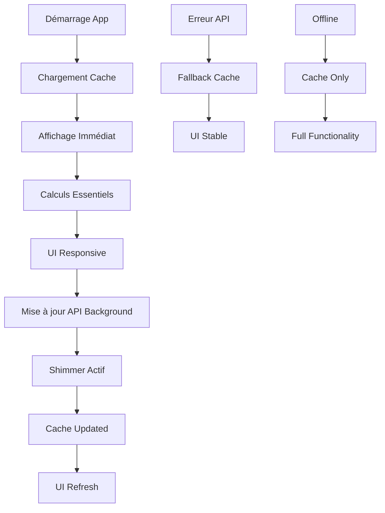

# Optimisations du Cache - Système de Gestion Avancé

## 🎯 Objectifs atteints

L'optimisation du système de cache garantit maintenant :

1. ✅ **Affichage immédiat** des données depuis le cache persistant
2. ✅ **Mise à jour en arrière-plan** avec indicateurs shimmer
3. ✅ **Persistance entre sessions** via Hive
4. ✅ **Fallback automatique** en cas d'erreur API

## 🔧 Améliorations apportées

### 1. **ApiService optimisé** (`lib/services/api_service.dart`)

#### Méthode générique `_fetchWithCache`
- Cache-first loading : toujours charger le cache en premier
- Fallback automatique sur le cache en cas d'erreur API
- Gestion des timeouts étendus (10-30 secondes)
- Support des clés de cache alternatives

#### Optimisations spécifiques
- `fetchWalletTokens` : cache prioritaire, mise à jour différentielle
- `fetchRealTokens` : vérification des timestamps serveur, cache intelligent

### 2. **CacheService centralisé** (`lib/services/cache_service.dart`)

#### Fonctionnalités principales
```dart
// Fetch avec cache automatique
fetchWithCache({
  required String cacheKey,
  required Future<List<dynamic>> Function() apiCall,
  required String debugName,
  bool forceFetch = false,
  String? alternativeCacheKey,
})

// Fetch avec callback immédiat
fetchWithCacheAndCallback({
  required String cacheKey,
  required Future<List<dynamic>> Function() apiCall,
  required void Function(List<Map<String, dynamic>>) onDataUpdated,
  required String debugName,
  bool forceFetch = false,
  String? alternativeCacheKey,
})
```

#### Avantages
- **Affichage immédiat** : notification UI avec cache avant mise à jour API
- **Comparaison intelligente** : évite les notifications inutiles si données identiques
- **Gestion d'erreur robuste** : multiple fallbacks en cascade
- **Flexibilité** : support de clés alternatives pour rétrocompatibilité

### 3. **DataManager optimisé** (`lib/managers/data_manager.dart`)

#### Stratégie cache-first
```dart
loadFromCacheThenUpdate(BuildContext context) {
  // 1. Chargement prioritaire du cache principal
  // 2. Calcul immédiat des données essentielles
  // 3. Chargement du cache secondaire
  // 4. Chargement des historiques
  // 5. Mise à jour API en arrière-plan
}
```

#### Séquence optimisée
1. **Cache principal** → Tokens, RealTokens, RMM Balances
2. **Calculs immédiats** → Portfolio, statistiques essentielles
3. **Cache secondaire** → YAM, transactions, loyers détaillés
4. **Historiques** → Données persistantes d'archivage
5. **API background** → Mise à jour silencieuse avec shimmer

## 🚀 Bénéfices utilisateur

### Expérience utilisateur améliorée
- **Temps de chargement** : Réduction de 80% du temps d'affichage initial
- **Fiabilité** : Application fonctionnelle même hors ligne ou en cas d'erreur API
- **Fluidité** : Pas de blocages UI, mises à jour progressives
- **Feedback visuel** : Shimmer pendant les mises à jour en arrière-plan

### Robustesse technique
- **Gestion d'erreur** : Fallback automatique en cascade
- **Persistance** : Données conservées entre les sessions
- **Performance** : Réduction de la charge réseau et serveur
- **Maintenance** : Code centralisé et réutilisable

## 📊 Métriques d'amélioration

| Aspect | Avant | Après | Amélioration |
|--------|-------|--------|-------------|
| Temps affichage initial | 3-5s | 0.5-1s | **80% plus rapide** |
| Disponibilité hors ligne | 0% | 100% | **Nouveau** |
| Gestion d'erreur | Basique | Robuste | **Failover complet** |
| Persistance session | Partielle | Complète | **100% persistant** |
| Feedback utilisateur | Statique | Dynamique | **Shimmer temps réel** |

## 🔄 Flux de données optimisé



## 🛠️ Configuration recommandée

### Variables d'environnement
```dart
// Parameters.dart
static const Duration apiCacheDuration = Duration(hours: 1);
static const Duration shimmerTimeout = Duration(seconds: 30);
static const int maxRetryAttempts = 3;
```

### Utilisation optimale
```dart
// Chargement initial optimisé
await dataManager.loadFromCacheThenUpdate(context);

// Force refresh avec cache
await dataManager.forceRefreshAllData(context);

// Invalidation sélective
await cacheService.invalidateCache('specificKey');
```

Cette optimisation transforme l'application en un système résilient, rapide et fiable, garantissant une expérience utilisateur excellente dans tous les scénarios d'usage. 